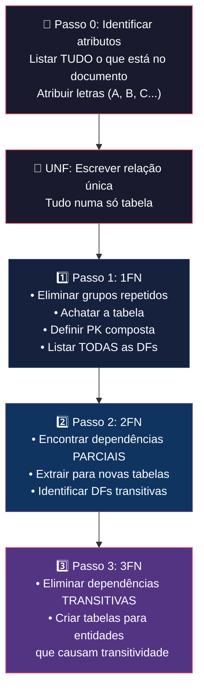

# 📐 Metodologia de Normalização — Aplicação a uma Fatura

## 📖 Visão Geral da Metodologia

A normalização é o processo de decompor uma tabela "chapada" (desnormalizada) em várias tabelas mais pequenas e bem estruturadas, eliminando redundâncias e anomalias. O método segue **4 passos sequenciais** (Passo 0 a Passo 3), cada um correspondendo a uma forma normal.

---

## 🔑 Resumo das Formas Normais (dos teus apontamentos)

| Forma Normal | Pré-requisito | O que eliminar |
|---|---|---|
| **1ª FN** | — | Grupos repetidos e/ou atributos multivalor |
| **2ª FN** | Estar na 1ª FN | Dependências **parciais** (atributo depende só de parte da chave) |
| **3ª FN** | Estar na 2ª FN | Dependências **transitivas** (atributo depende da chave via outro atributo não-chave) |

---

## 🧩 Passo 0 — Identificar os Atributos do Documento

> **Objetivo:** Olhar para o documento (a fatura) e listar **todos** os campos de dados visíveis. Atribuir uma letra a cada um para simplificar a notação.

### Atributos típicos de uma Fatura

Ao analisar uma fatura comercial típica portuguesa, encontramos estes campos:

| Letra | Atributo | Onde aparece na fatura |
|---|---|---|
| A | NIF da Empresa | Cabeçalho (quem emite) |
| B | Nome da Empresa | Cabeçalho |
| C | Morada da Empresa | Cabeçalho |
| D | Código Postal da Empresa | Cabeçalho |
| E | NIF do Cliente | Dados do cliente |
| F | Nome do Cliente | Dados do cliente |
| G | Número da Fatura | Identificação do documento |
| H | Data da Fatura | Identificação do documento |
| I | ATCUD | Código único do documento (AT) |
| J | Código do Artigo | Linhas da fatura (repete-se por artigo) |
| K | Descrição do Artigo | Linhas da fatura |
| L | Quantidade | Linhas da fatura |
| M | Preço Unitário | Linhas da fatura |
| N | Taxa de IVA | Linhas da fatura |
| O | Subtotal da Linha | Linhas da fatura (Qtd × Preço) |
| P | Total da Fatura | Rodapé |

### UNF (Forma Não Normalizada)

Escrevemos **tudo** numa única relação "chapada":

```
Fatura(G, A, B, C, D, E, F, H, I, J, K, L, M, N, O, P)
```

> [!NOTE]
> O **grupo repetido** são as linhas de artigos: `{J, K, L, M, N, O}`. Numa fatura com 5 artigos, estes campos aparecem 5 vezes. É este grupo que vamos tratar na 1ª FN.

---

## 🔹 Passo 1 — 1ª Forma Normal (1FN)

> **Definição:** Uma relação está na 1FN se **todos os valores são atómicos** e **não existem grupos repetidos**.

### Como fazer:

1. **Identificar o grupo repetido** → Os artigos `{J, K, L, M, N, O}` repetem-se por fatura
2. **Achatar a tabela** → Cada linha de artigo gera uma linha completa na tabela
3. **Definir a chave primária composta** → Precisamos de identificar unicamente cada registo. A combinação `(G, J)` = (NumFatura, CodArtigo) identifica cada linha

### Resultado na 1FN:

```
Fatura_1FN(G, J, A, B, C, D, E, F, H, I, K, L, M, N, O, P)
                                    
PK: (G, J)  →  (NumFatura, CodArtigo)
```

### Identificar TODAS as Dependências Funcionais (DFs):

```
G → A, B, C, D, E, F, H, I, P       (Tudo do cabeçalho depende do nº fatura)
J → K, M, N                          (Descrição, preço e IVA dependem do código artigo)
G, J → L, O                          (Quantidade e subtotal dependem da combinação fatura+artigo)
A → B, C, D                          (Nome/morada/CP dependem do NIF empresa)
E → F                                (Nome do cliente depende do NIF do cliente)
```

### Análise para a 2FN — Dependências Parciais:

> [!IMPORTANT]
> Uma **dependência parcial** ocorre quando um atributo não-chave depende de **apenas parte** da chave composta (em vez de toda a chave).

Sendo a PK = `(G, J)`, analisamos:

| Dependência | Tipo | Problema? |
|---|---|---|
| `G → A, B, C, D, E, F, H, I, P` | **PARCIAL** (depende só de G) | ✅ Viola a 2FN |
| `J → K, M, N` | **PARCIAL** (depende só de J) | ✅ Viola a 2FN |
| `G, J → L, O` | **TOTAL** (depende de toda a PK) | ❌ OK |

---

## 🔹 Passo 2 — 2ª Forma Normal (2FN)

> **Definição:** Relação na 1FN em que **todos os atributos não-chave dependem inteiramente da TODA a chave primária** (eliminar dependências parciais).

### Como fazer:

1. **Extrair** os atributos que dependem **só de parte da chave** para novas tabelas
2. **Manter** na tabela original apenas o que depende de **toda a chave composta**

### Resultado na 2FN:

```
Fatura(G, A, B, C, D, E, F, H, I, P)
    PK: G (NumFatura)

Artigo(J, K, M, N)
    PK: J (CodArtigo)

LinhaFatura(G, J, L, O)
    PK: (G, J)
    FK: G → Fatura
    FK: J → Artigo
```

### Análise para a 3FN — Dependências Transitivas:

> [!IMPORTANT]
> Uma **dependência transitiva** ocorre quando: `A → B → C`, ou seja, um atributo não-chave determina outro atributo não-chave. Exemplo: `G → A → B` (NumFatura determina NIF_Empresa, e NIF_Empresa determina Nome_Empresa).

Na tabela **Fatura**, encontramos:
- `G → A` e `A → B, C, D` → **Transitiva!** (NIF empresa → Nome/Morada/CP empresa)
- `G → E` e `E → F` → **Transitiva!** (NIF cliente → Nome cliente)

---

## 🔹 Passo 3 — 3ª Forma Normal (3FN)

> **Definição:** Relação na 2FN em que **nenhum atributo não-chave depende transitivamente da chave primária** (ou seja, todos os determinantes são chaves candidatas).

### Como fazer:

1. **Identificar** os atributos que causam transitividade (os "intermediários")
2. **Extrair** esses atributos e os que deles dependem para novas tabelas
3. Na tabela original, manter apenas a **chave estrangeira** (o intermediário)

### Decomposição:

De `Fatura(G, A, B, C, D, E, F, H, I, P)`:

- A transitividade `G → A → B, C, D` gera → **Empresa(A, B, C, D)**
- A transitividade `G → E → F` gera → **Cliente(E, F)**
- Fatura fica sem B, C, D (que foram para Empresa) e sem F (que foi para Cliente)

---

## ✅ Resultado Final — Tabelas na 3ª Forma Normal

```
┌─────────────────────────────────────────────────────────────────────┐
│  Empresa(NIF_Empresa, Nome, Morada, CodPostal)                    │
│      PK: NIF_Empresa                                               │
├─────────────────────────────────────────────────────────────────────┤
│  Cliente(NIF_Cliente, Nome)                                        │
│      PK: NIF_Cliente                                               │
├─────────────────────────────────────────────────────────────────────┤
│  Fatura(NumFatura, Data, ATCUD, NIF_Empresa, NIF_Cliente, Total)  │
│      PK: NumFatura                                                 │
│      FK: NIF_Empresa → Empresa                                     │
│      FK: NIF_Cliente → Cliente                                     │
├─────────────────────────────────────────────────────────────────────┤
│  Artigo(CodArtigo, Descricao, PrecoUnitario, TaxaIVA)             │
│      PK: CodArtigo                                                 │
│      (Nota: PrecoUnitario e TaxaIVA são intrínsecos ao artigo)     │
├─────────────────────────────────────────────────────────────────────┤
│  LinhaFatura(NumFatura, CodArtigo, Quantidade, Subtotal)           │
│      PK: (NumFatura, CodArtigo)                                    │
│      FK: NumFatura → Fatura                                        │
│      FK: CodArtigo → Artigo                                        │
└─────────────────────────────────────────────────────────────────────┘
```

## 📊 Dependências Funcionais Finais

```
NumFatura → Data, ATCUD, NIF_Empresa, NIF_Cliente, Total
NIF_Empresa → Nome, Morada, CodPostal
NIF_Cliente → Nome
CodArtigo → Descricao, PrecoUnitario, TaxaIVA
NumFatura, CodArtigo → Quantidade, Subtotal
```

---

## 🎯 Resumo da Metodologia (Checklist para o Exame)



> [!TIP]
> **Truque para o exame:** Depois de chegar à 1FN, desenha o diagrama de barras (como nos teus apontamentos da imagem 2) para visualizar quais atributos dependem de que parte da chave. As dependências parciais ficam imediatamente visíveis!

> [!WARNING]
> **Erros comuns a evitar:**
> - Esquecer de identificar as dependências transitivas (A→B→C)
> - Não incluir as chaves estrangeiras nas tabelas decompostas
> - Confundir "grupo repetido" com "atributo multivalor" (ambos violam a 1FN, mas tratam-se de forma diferente)
> - Não marcar as PKs e FKs de cada tabela no resultado final

---

## 📝 Nota sobre o PDF da Fatura

Não foi possível extrair o texto diretamente do ficheiro Fatura.pdf porque o PDF usa fontes embebidas que impedem a extração de texto. No entanto, a resolução acima aplica-se a **qualquer fatura comercial portuguesa** porque os campos são padronizados. Se a tua fatura tiver campos adicionais (ex: método de pagamento, mesa, empregado num restaurante), basta adicioná-los ao Passo 0 e seguir a mesma metodologia.

---

## 🍷 Exercício Prático Resolvido — Fatura da Loja de Vinhos (Exemplo da Imagem)

Este exercício foi retirado de uma prova prática de Base de Dados e foca-se na normalização de uma fatura de venda de vinhos.

### 📋 O Enunciado (Dados Visíveis na Imagem)

```text
Fatura: 24F347
Data de emissão: 25 de Janeiro de 2017
NIF do cliente: 19293849
Nome do cliente: João Oliveira
Cliente Sócio?: Não
Emitido por (funcionário): 123 - João Castro

Produtos
=============================================================================
Código       Descrição              Quantidade       Preço Unitário
01FF         Vinho de Porto             4                 8.5
03GG         Vinho Moscatel             3                 7.5
(...)
=============================================================================
Valor Total: 16 euros  Desconto: 10%  Valor a Cobrar: 14,4 euros
----
Morada de entrega: Rua de Lordelo, 4610, Felgueiras
Método de pagamento (Cobrança, Transferência): Transferência
```
*Nota: Embora as quantidades e preços unitários dos dois artigos apresentados (4 × 8.5 + 3 × 7.5 = 56.5€) não somem os "16 euros" do Valor Total (indicando que a fatura tem mais linhas ocultas sob a marca `(...)`), a modelação lógica do esquema é exatamente a mesma.*

---

### 🧩 Passo 0 — Identificar os Atributos do Documento

Analisando a fatura da loja de vinhos, listamos todos os atributos e associamos uma letra/notação:

| Letra | Atributo | Exemplo no Documento | Significado |
| :---: | :--- | :--- | :--- |
| **A** | `NumFatura` | `24F347` | Identificador único do documento |
| **B** | `DataEmissao` | `25 de Janeiro de 2017` | Data em que a fatura foi gerada |
| **C** | `NIFCliente` | `19293849` | NIF do cliente |
| **D** | `NomeCliente` | `João Oliveira` | Nome do cliente |
| **E** | `ClienteSocio` | `Não` (ou `Sim`) | Estado de sócio do cliente |
| **F** | `CodFuncionario` | `123` | Código do funcionário que emitiu a fatura |
| **G** | `NomeFuncionario` | `João Castro` | Nome do funcionário |
| **H** | `CodProduto` | `01FF`, `03GG` | Código único do produto |
| **I** | `DescricaoProduto` | `Vinho de Porto` | Descrição do produto |
| **J** | `Quantidade` | `4` | Quantidade comprada do produto |
| **K** | `PrecoUnitario` | `8.5` | Preço unitário do produto |
| **L** | `ValorTotal` | `16` | Valor total bruto antes de descontos |
| **M** | `Desconto` | `10` (representa 10%) | Desconto comercial aplicado |
| **N** | `ValorACobrar` | `14.4` | Valor final líquido pago pelo cliente |
| **O** | `MoradaEntrega` | `Rua de Lordelo` | Rua/número da morada de entrega |
| **P** | `CodPostalEntrega` | `4610` | Código postal da morada de entrega |
| **Q** | `LocalidadeEntrega` | `Felgueiras` | Localidade associada ao código postal |
| **R** | `MetodoPagamento` | `Transferência` | Método de pagamento escolhido |

#### Relação Não Normalizada (UNF)

Colocamos todos os atributos numa relação única, destacando o grupo repetido correspondente aos produtos comprados (assinalado entre chavetas `{ }`):

```text
Fatura_UNF(A, B, C, D, E, F, G, L, M, N, O, P, Q, R, {H, I, J, K})
```

---

### 🔹 Passo 1 — 1ª Forma Normal (1FN)

> **Objetivo:** Eliminar grupos repetidos (produtos) e obter atributos atómicos.

1. **Eliminar o grupo repetido:** O grupo `{H, I, J, K}` é extraído e "achatado" para cada linha da fatura.
2. **Chave Primária Composta:** Para identificar unicamente cada linha de venda de um produto numa determinada fatura, usamos a combinação de `NumFatura` (**A**) e `CodProduto` (**H**).

#### Resultado na 1FN:
```text
Fatura_1FN(A, H, B, C, D, E, F, G, I, J, K, L, M, N, O, P, Q, R)

PK: (A, H) -> (NumFatura, CodProduto)
```

#### Dependências Funcionais (DFs) Identificadas:
1. `A → B, C, E, F, L, M, N, O, P, R` (Os dados do cabeçalho, cliente, funcionário, totais, entrega e pagamento dependem do número da fatura)
2. `H → I, K` (A descrição e o preço unitário dependem do código do produto)
3. `A, H → J` (A quantidade vendida depende da combinação da fatura e do produto específico)
4. `C → D, E` (O nome do cliente e a sua condição de sócio dependem do NIF do cliente)
5. `F → G` (O nome do funcionário depende do seu código identificador)
6. `P → Q` (A localidade de entrega depende do código postal)

---

### 🔹 Passo 2 — 2ª Forma Normal (2FN)

> **Objetivo:** Garantir que todos os atributos não-chave dependem da chave primária na sua **totalidade** (eliminar dependências parciais).

A chave primária é composta: `(A, H)`.
* `A → B, C, D, E, F, G, L, M, N, O, P, Q, R` é uma **dependência parcial** (depende apenas de A).
* `H → I, K` é uma **dependência parcial** (depende apenas de H).
* `A, H → J` é uma **dependência total** (depende de A e H).

Decompomos a relação criando tabelas independentes para as dependências parciais:

#### Resultado na 2FN:

1. **Fatura_Base (A, B, C, D, E, F, G, L, M, N, O, P, Q, R)**
   * **PK:** `A` (`NumFatura`)
2. **Produto (H, I, K)**
   * **PK:** `H` (`CodProduto`)
3. **Linha_Fatura (A, H, J)**
   * **PK:** `(A, H)` (`NumFatura`, `CodProduto`)
   * **FK:** `A → Fatura_Base`
   * **FK:** `H → Produto`

---

### 🔹 Passo 3 — 3ª Forma Normal (3FN)

> **Objetivo:** Eliminar dependências transitivas (atributos não-chave que dependem de outros atributos não-chave).

Analisamos a tabela **Fatura_Base** (cuja PK é `A`):
* `A → C` (NIFCliente) e `C → D, E` (Nome, Sócio) ⇒ **Transitiva!**
* `A → F` (CodFuncionario) e `F → G` (NomeFuncionario) ⇒ **Transitiva!**
* `A → P` (CodPostalEntrega) e `P → Q` (LocalidadeEntrega) ⇒ **Transitiva!**

Decompomos estas relações para remover as transitividades:

#### Resultado Final na 3FN:

```text
Cliente(NIFCliente, NomeCliente, ClienteSocio)
    PK: NIFCliente

Funcionario(CodFuncionario, NomeFuncionario)
    PK: CodFuncionario

CodigoPostal(CodPostal, Localidade)
    PK: CodPostal

Fatura(NumFatura, DataEmissao, NIFCliente, CodFuncionario, ValorTotal, Desconto, ValorACobrar, MoradaEntrega, CodPostalEntrega, MetodoPagamento)
    PK: NumFatura
    FK: NIFCliente → Cliente
    FK: CodFuncionario → Funcionario
    FK: CodPostalEntrega → CodigoPostal

Produto(CodProduto, DescricaoProduto, PrecoUnitario)
    PK: CodProduto

LinhaFatura(NumFatura, CodProduto, Quantidade)
    PK: (NumFatura, CodProduto)
    FK: NumFatura → Fatura
    FK: CodProduto → Produto
```

---

### 💡 Dicas e Detalhes Importantes deste Exercício:

> [!TIP]
> 1. **ClienteSocio na Tabela Cliente:** Colocamos `ClienteSocio` na tabela `Cliente` porque é um atributo intrínseco do cliente. Se a política de sócio pudesse mudar de fatura para fatura (por exemplo, um cliente deixar de ser sócio mas querermos preservar o histórico da fatura com a taxa correta), poderíamos considerar guardar essa informação diretamente na `Fatura`. Contudo, em termos de normalização clássica de exames, o estado do cliente pertence à tabela do cliente.
> 2. **Preço Unitário:** O `PrecoUnitario` foi colocado na tabela `Produto` sob a DF `H → K`. Se o preço variasse por fatura (por exemplo, descontos personalizados por linha), a DF correta seria `(A, H) → K`, o que o manteria na tabela `LinhaFatura`. Dado o enunciado simples, assumimos o preço como propriedade do produto.
> 3. **Código Postal:** A decomposição de `CodPostalEntrega → LocalidadeEntrega` é um exemplo claro de como a normalização à 3FN limpa tabelas de redundâncias geográficas.

---

## 🍽️ Exercício Prático Resolvido — Fatura de Restaurante (Momento Surpresa)

Este exercício foca-se na normalização de uma fatura de restauração (talão de consumo) que possui particularidades interessantes, como um funcionário (empregado), identificação da mesa, e um resumo de impostos (IVA) no rodapé.

### 📋 O Enunciado (Dados Visíveis na Imagem)

```text
Momento Surpresa - Eventos em Hotelaria, Unip. Lda
Zona Industrial do Socorro
4820-000
NIF: PT509468268

Data: 2025-06-17, 13:20:23
Factura\Recibo n: FR S1/0033537

Cliente:
NIF: 515870358
Lote Z - 2 Quinchães
FAFE

Qt   Desc.                    IVA    p.unit    total
Lote Z - 2 Quinchães
FAFE
1    DIARIA COM AGUA
       PRATO                  13%              €6,50
       SOPA                   13%              €1,00
       SOBREMESA              13%              €1,50
----------------------------------------------------
Total:                                         €9,00
Metodos de Pagamento:
       Multibanco                              €9,00
----------------------------------------------------
Taxa       Incid.       Valor       Total
13%        €7,96        €1,04       €9,00
Total:     €7,96        €1,04       €9,00
----------------------------------------------------
Empregado: MIGUEL
Mesa:      REDONDA
```

---

### 🧩 Passo 0 — Identificar os Atributos do Documento

Analisando o talão, listamos todos os atributos e associamos uma letra/notação:

| Letra | Atributo | Exemplo no Documento | Significado |
| :---: | :--- | :--- | :--- |
| **A** | `NumFactura` | `FR S1/0033537` | Identificador único da fatura/recibo |
| **B** | `DataHora` | `2025-06-17 13:20:23` | Data e hora de emissão |
| **C** | `NIFEmpresa` | `509468268` (sem prefixo PT) | NIF do emitente (restaurante) |
| **D** | `NomeEmpresa` | `Momento Surpresa - Eventos...` | Nome do emitente |
| **E** | `MoradaEmpresa` | `Zona Industrial do Socorro` | Morada do emitente |
| **F** | `CodPostalEmpresa`| `4820-000` | Código postal do emitente |
| **G** | `NIFCliente` | `515870358` | NIF do cliente |
| **H** | `MoradaCliente` | `Lote Z - 2 Quinchães` | Morada do cliente |
| **I** | `LocalidadeCliente`| `FAFE` | Localidade do cliente |
| **J** | `NomeEmpregado` | `MIGUEL` | Nome do funcionário que atendeu |
| **K** | `Mesa` | `REDONDA` | Identificação da mesa |
| **L** | `MetodoPagamento` | `Multibanco` | Método de pagamento utilizado |
| **M** | `TotalFactura` | `9.00` | Valor total pago |
| **N** | `CodArtigo` | *(Criado para identificar produtos)* | Identificador do artigo |
| **O** | `DescricaoArtigo` | `DIARIA COM AGUA - PRATO` | Nome do prato/bebida |
| **P** | `Quantidade` | `1` | Quantidade consumida |
| **Q** | `PrecoUnitario` | `6.50` | Preço unitário do artigo |
| **R** | `TaxaIVA` | `13%` (ou `0.13`) | Taxa de IVA aplicada ao artigo |
| **S** | `TotalLinha` | `6.50` | Subtotal da linha de consumo |
| **T** | `IncidenciaIVA` | `7.96` | Base tributável para uma determinada taxa |
| **U** | `ValorIVA` | `1.04` | Valor do imposto pago para essa taxa |

> [!NOTE]
> **Dois Grupos Repetidos Independentes:** Este documento possui duas listas independentes (tabelas aninhadas):
> 1. Os **itens de consumo** (`{N, O, P, Q, R, S}`).
> 2. O **resumo de IVA por taxa** no rodapé (`{R, T, U}`).

#### Relação Não Normalizada (UNF)

```text
Factura_UNF(A, B, C, D, E, F, G, H, I, J, K, L, M, {N, O, P, Q, R, S}, {R, T, U})
```

---

### 🔹 Passo 1 — 1ª Forma Normal (1FN)

> **Objetivo:** Eliminar grupos repetidos (valores não atómicos).

Como temos dois grupos repetidos independentes, se mantivéssemos tudo numa única tabela teríamos um produto cartesiano incorreto. Por isso, decompomos imediatamente nos seus grupos lógicos:

#### Resultado na 1FN:

1. **Factura_1FN (A, B, C, D, E, F, G, H, I, J, K, L, M)**
   * **PK:** `A` (`NumFactura`)
2. **LinhaFactura_1FN (A, N, O, P, Q, R, S)**
   * **PK:** `(A, N)` (Combinação do número da fatura com o código do artigo)
3. **ResumoIVA_1FN (A, R, T, U)**
   * **PK:** `(A, R)` (Combinação da fatura com a taxa de IVA)

#### Dependências Funcionais (DFs) Identificadas:

* **Na tabela Factura:**
  * `A → B, C, G, J, K, L, M` (NumFactura determina dados da transação, cabeçalhos, cliente e totais)
  * `C → D, E, F` (NIF da empresa determina o seu nome, morada e código postal)
  * `G → H, I` (NIF do cliente determina a sua morada e localidade)

* **Na tabela LinhaFactura:**
  * `(A, N) → P, S` (A quantidade e o subtotal da linha dependem da fatura e do artigo)
  * `N → O, Q, R` (A descrição, preço e taxa de IVA dependem do artigo em si)

* **Na tabela ResumoIVA:**
  * `(A, R) → T, U` (A incidência e o valor do IVA dependem da fatura e da taxa correspondente)

---

### 🔹 Passo 2 — 2ª Forma Normal (2FN)

> **Objetivo:** Eliminar dependências parciais nas tabelas com chaves compostas.

Analisando as chaves compostas:
* Em **LinhaFactura_1FN** com PK `(A, N)`, temos a dependência parcial: `N → O, Q, R` (artigo depende apenas do seu código).
* Em **ResumoIVA_1FN** com PK `(A, R)`, a dependência `(A, R) → T, U` é total (precisamos do documento e da taxa para saber a incidência e valor acumulados).

Decompomos a tabela de linhas para isolar o Artigo:

#### Resultado na 2FN:

1. **Factura_Base (A, B, C, G, J, K, L, M)**
   * **PK:** `A`
2. **Artigo (N, O, Q, R)**
   * **PK:** `N`
3. **LinhaFactura (A, N, P, S)**
   * **PK:** `(A, N)`
   * **FK:** `A → Factura_Base`, `N → Artigo`
4. **ResumoIVA (A, R, T, U)**
   * **PK:** `(A, R)`
   * **FK:** `A → Factura_Base`

---

### 🔹 Passo 3 — 3ª Forma Normal (3FN)

> **Objetivo:** Eliminar dependências transitivas (atributos não-chave que determinam outros).

Analisamos a tabela **Factura_Base** com PK `A`:
* `A → C` (NIFEmpresa) e `C → D, E, F` (Empresa) ⇒ **Transitiva!**
* `A → G` (NIFCliente) e `G → H, I` (Cliente) ⇒ **Transitiva!**

Decompomos a tabela base para extrair a Empresa e o Cliente:

#### Resultado Final na 3FN:

```text
Empresa(NIFEmpresa, NomeEmpresa, MoradaEmpresa, CodPostalEmpresa)
    PK: NIFEmpresa

Cliente(NIFCliente, MoradaCliente, LocalidadeCliente)
    PK: NIFCliente

Artigo(CodArtigo, DescricaoArtigo, PrecoUnitario, TaxaIVA)
    PK: CodArtigo

Factura(NumFactura, DataHora, NIFEmpresa, NIFCliente, NomeEmpregado, Mesa, MetodoPagamento, TotalFactura)
    PK: NumFactura
    FK: NIFEmpresa → Empresa
    FK: NIFCliente → Cliente

LinhaFactura(NumFactura, CodArtigo, Quantidade, TotalLinha)
    PK: (NumFactura, CodArtigo)
    FK: NumFactura → Factura
    FK: CodArtigo → Artigo

ResumoIVA(NumFactura, TaxaIVA, IncidenciaIVA, ValorIVA)
    PK: (NumFactura, TaxaIVA)
    FK: NumFactura → Factura
```

---

### 💡 Dicas e Detalhes Importantes deste Exercício:

> [!TIP]
> 1. **Como modelar o menu "DIARIA COM AGUA":** No talão, o item principal "DIARIA COM AGUA" tem quantidade "1", mas o valor financeiro está dividido em três sub-linhas (PRATO, SOPA, SOBREMESA), cada uma com o seu preço e taxa de IVA individual. A nível conceptual de normalização, cada uma destas sub-linhas funciona como uma linha de fatura individualizada (ex: `DIARIA COM AGUA - PRATO`), uma vez que são estas sub-linhas que possuem valores monetários e registo fiscal.
> 2. **Tabela ResumoIVA (Rodapé):** O resumo de IVA no rodapé do talão é uma entidade agregadora. Embora em bases de dados transacionais reais estes valores possam ser calculados dinamicamente via queries (`SUM`), no âmbito de exercícios académicos de modelação e normalização baseada em documentos físicos, deve ser mapeado como uma tabela fraca/dependente cuja chave primária é `(NumFactura, TaxaIVA)`.
> 3. **Nome do Empregado e Mesa:** Foram mantidos na tabela `Factura` porque dependem diretamente da fatura emitida. Se tivéssemos um `CodEmpregado`, poderíamos criar uma tabela `Empregado(CodEmpregado, Nome)`. Na falta de um ID explícito para o funcionário, mantém-se o atributo descritivo na fatura.

---

## 💻 Exercício Prático Resolvido — Fatura Worten

Este exercício foca-se na normalização de uma fatura de retalho tecnológico (Worten) que possui a particularidade de ter **números de série (S/N)** para cada unidade de produto vendida, o que altera a granularidade das linhas de venda.

### 📋 O Enunciado (Dados Visíveis na Fatura Worten)

```text
Worten - Equipamento para o Lar, S.A.
Endereço: Rua João Mendonça 505, 4464-501 Senhora da Hora
NIF: 503630330
Email: cliente@worten.pt
Telefone: 808 100 007
Capital Social: 16.150.000
Sede do Registo: C.R.C do Porto

Original
Fatura Recibo FRD 20A1460/22899

Referência: 32547549
Moeda: EUR
Data: 26/02/2020
NIF: 515870358 (Cliente)
Condições de Pagamento: Pronto Pagamento

Cliente:
DATANAU - CONSULTORIA INFORMÁTICA, UNIPESSOAL LDA
Rua do Curral - Edif. Miguel Bl.3 - 4º Esq
4610-15

Artigo    Descrição                                               Qtd. Un.  Preço Unitário  Desconto  IVA  Total
7041524   Monitor LENOVO L24E-20 (24" - Full HD - 6 ms)           1 UN      99,99           0%        23%  99,99
          EAN: 0192563041252
          S/N: SU45DMDNH
7041524   Monitor LENOVO L24E-20 (24" - Full HD - 6 ms)           1 UN      99,99           0%        23%  99,99
          EAN: 0192563041252
          S/N: SU45DMDNF
7041524   Monitor LENOVO L24E-20 (24" - Full HD - 6 ms)           1 UN      99,99           0%        23%  99,99
          EAN: 0192563041252
          S/N: SU45DMDMD
7041524   Monitor LENOVO L24E-20 (24" - Full HD - 6 ms)           1 UN      99,99           0%        23%  99,99
          EAN: 0192563041252
          S/N: SU45DMDRA
04504829  Taxa de entrega                                         1 UN      3,77            0%        23%  3,77

Descrição do(s) método(s) de pagamento:
Multibanco - Autorização 888943479

Produtos e Serviços: 328,23 €   Desconto: 0,00 €   Líquido: 328,23 €   IVA: 75,50 €
Total: 403,73 €                 Retenção: 0,00 €   Total a Pagar: 403,73 €

Imposto   Taxa      Incidência    Valor
IVA       23,00%    328,23        75,50
```

---

### 🧩 Passo 0 — Identificar os Atributos do Documento

| Letra | Atributo | Exemplo no Documento | Significado |
| :---: | :--- | :--- | :--- |
| **A** | `NumFatura` | `FRD 20A1460/22899` | Chave primária da fatura |
| **B** | `Data` | `26/02/2020` | Data de emissão |
| **C** | `NIFEmpresa` | `503630330` | NIF da Worten |
| **D** | `NomeEmpresa` | `Worten - Equipamento para o Lar, S.A.` | Nome da empresa emitente |
| **E** | `MoradaEmpresa` | `Rua João Mendonça 505` | Morada do emitente |
| **F** | `CodPostalEmpresa` | `4464-501` | Código postal do emitente |
| **G** | `LocalidadeEmpresa`| `Senhora da Hora` | Localidade do emitente |
| **H** | `NIFCliente` | `515870358` | NIF do cliente |
| **I** | `NomeCliente` | `DATANAU - CONSULTORIA...` | Nome/Designação do cliente |
| **J** | `MoradaCliente` | `Rua do Curral...` | Morada do cliente |
| **K** | `CodPostalCliente` | `4610-15` | Código postal do cliente |
| **L** | `CondicoesPagamento`| `Pronto Pagamento` | Condição comercial de pagamento |
| **M** | `MetodoPagamento` | `Multibanco (Aut: 888943479)` | Descrição do método de pagamento |
| **N** | `ReferenciaFatura` | `32547549` | Referência interna do documento |
| **O** | `ProdutosServicosTotal`| `328.23` | Total bruto dos itens |
| **P** | `DescontoTotal` | `0.00` | Valor total de descontos comerciais |
| **Q** | `LiquidoTotal` | `328.23` | Base tributável total da fatura |
| **R** | `IVATotal` | `75.50` | Valor total de IVA liquidado |
| **S** | `TotalAPagar` | `403.73` | Valor total final a pagar |
| **T** | `NumLinha` | *(Atributo sequencial sugerido)* | Identificador da linha da fatura |
| **U** | `CodArtigo` | `7041524`, `04504829` | Código interno do produto/serviço |
| **V** | `DescricaoArtigo` | `Monitor LENOVO L24E-20` | Designação do produto/serviço |
| **W** | `EAN` | `0192563041252` | Código de barras do artigo |
| **X** | `SerialNumber` | `SU45DMDNH` (opcional/nulo em serviços) | Número de série físico do item |
| **Y** | `Quantidade` | `1` | Quantidade faturada |
| **Z** | `PrecoUnitario` | `99.99` | Preço de tabela do produto |
| **AA** | `DescontoLinha` | `0%` | Desconto específico aplicado à linha |
| **AB** | `TaxaIVA` | `23%` | Taxa de IVA aplicada ao produto |
| **AC** | `TotalLinha` | `99.99` | Subtotal da linha (Qtd × Preço Unitário × Desconto) |
| **AD** | `IncidenciaIVA` | `328.23` | Valor base para a taxa de IVA |
| **AE** | `ValorIVA` | `75.50` | Valor do imposto apurado |

#### Relação Não Normalizada (UNF)

```text
Fatura_UNF(A, B, C, D, E, F, G, H, I, J, K, L, M, N, O, P, Q, R, S, {T, U, V, W, X, Y, Z, AA, AB, AC}, {AB, AD, AE})
```

---

### 🔹 Passo 1 — 1ª Forma Normal (1FN)

Decompomos nos dois grupos lógicos para evitar produto cartesiano:

1. **Fatura_1FN (A, B, C, D, E, F, G, H, I, J, K, L, M, N, O, P, Q, R, S)**
   * **PK:** `A` (`NumFatura`)
2. **LinhaFatura_1FN (A, T, U, V, W, X, Y, Z, AA, AB, AC)**
   * **PK:** `(A, T)` (Fatura + Linha)
3. **ResumoIVA_1FN (A, AB, AD, AE)**
   * **PK:** `(A, AB)` (Fatura + TaxaIVA)

#### Dependências Funcionais (DFs) Identificadas:

* `A → B, H, L, M, N, O, P, Q, R, S`
* `C → D, E, F, G` (A empresa Worten é fixa)
* `H → I, J, K` (Cliente e sua morada dependem do NIF)
* `U → V, W, Z, AB` (O EAN do produto determina descrição, preço de tabela e IVA)
* `U ↔ U` (EAN e CodArtigo `U` determinam-se mutuamente)
* `X → U` (Um número de série pertence a um EAN/produto específico)
* `(A, T) → U, X, Y, AA, AC` (Linha de fatura determina o artigo, nº de série, quantidade vendida, desconto e total)
* `(A, AB) → AD, AE` (Resumo de IVA por taxa)

---

### 🔹 Passo 2 — 2ª Forma Normal (2FN)

Analisamos as chaves compostas para dependências parciais:
* Em **LinhaFatura_1FN** com PK `(A, T)`, o atributo `U` (CodArtigo) determina `V` (Descrição), `W` (EAN), `Z` (Preço) e `AB` (Taxa IVA). Isso são dependências parciais!
* Decompomos a tabela de linhas para isolar o **Artigo** e o **ItemFísico** (com S/N):

#### Resultado na 2FN:

1. **Fatura_Base (A, B, C, H, L, M, N, O, P, Q, R, S)**
   * **PK:** `A`
2. **Artigo (U, V, W, Z, AB)**
   * **PK:** `U` (`CodArtigo` ou `EAN`)
3. **LinhaFatura (A, T, U, X, Y, AA, AC)**
   * **PK:** `(A, T)`
   * **FK:** `A → Fatura_Base`, `U → Artigo`
4. **ResumoIVA (A, AB, AD, AE)**
   * **PK:** `(A, AB)`
   * **FK:** `A → Fatura_Base`

---

### 🔹 Passo 3 — 3ª Forma Normal (3FN)

Eliminamos dependências transitivas em **Fatura_Base**:
* `A → H` (NIFCliente) e `H → I, J, K` (Dados Cliente) ⇒ **Transitiva!**
* `C → D, E, F, G` ⇒ Como o emitente (Worten) é constante em todas as faturas deste sistema de faturação, criamos uma tabela global do **Emitente** para evitar replicação desnecessária.

#### Resultado Final na 3FN:

```text
Emitente(NIFEmpresa, NomeEmpresa, MoradaEmpresa, CodPostalEmpresa, LocalidadeEmpresa)
    PK: NIFEmpresa

Cliente(NIFCliente, NomeCliente, MoradaCliente, CodPostalCliente)
    PK: NIFCliente

Artigo(CodArtigo, DescricaoArtigo, EAN, PrecoUnitario, TaxaIVA)
    PK: CodArtigo

Fatura(NumFatura, DataEmissao, NIFEmpresa, NIFCliente, CondicoesPagamento, MetodoPagamento, ReferenciaFatura, ProdutosServicosTotal, DescontoTotal, LiquidoTotal, IVATotal, TotalAPagar)
    PK: NumFatura
    FK: NIFEmpresa → Emitente
    FK: NIFCliente → Cliente

LinhaFatura(NumFatura, NumLinha, CodArtigo, SerialNumber, Quantidade, DescontoLinha, TotalLinha)
    PK: (NumFatura, NumLinha)
    FK: NumFatura → Fatura
    FK: CodArtigo → Artigo

ResumoIVA(NumFatura, TaxaIVA, IncidenciaIVA, ValorIVA)
    PK: (NumFatura, TaxaIVA)
    FK: NumFatura → Fatura
```

---

## 🍅 Exercício Prático Resolvido — Fatura Tomatino (Solução Oficial P7)

Este exercício apresenta a transcrição rigorosa da **Resolução do Exercício de Normalização da Fatura Simplificada do Tomatino** com base nas notas manuscritas oficiais (`Res_P7_EN_2023_2024.pdf`).

### 📋 Mapeamento de Atributos lidos da Fatura (Letras da Resolução)

* **A** : `NIF Emitente (Restaurante)` — `515870358`
* **B** : `Num Fatura` — `FS 707/170833` (Identificador único do documento)
* **C** : `Data` — `2024-06-17`
* **D** : `Hora` — `12:27:27`
* **E** : `Quantidade (Qtd)` — `1`
* **F** : `Artigo (Descrição)` — `Mn Bologna 200g`, `*MASSA 200g`, etc.
* **G** : `Taxa IVA da Linha` — `13` (representa 13%)
* **H** : `Total da Linha` — `e 6.88`, `e 1.37`
* **I** : `Total do Documento` — `e 8.25`
* **J** : `Balcão` — `BALCAO 1`
* **K** : `Empregado` — `Sonia Figueiredo`
* **L** : `Taxa IVA do Resumo` — `13.00`
* **M** : `Base de Incidência` — `e 7.30`
* **N** : `Valor do IVA` — `e 0.95`
* **O** : `Total IVA` — `e 8.25`
* **P** : `Consultas`
* **Q** : `Mesa` — `mesa 1`
* **R** : `Pontos` — `Ganhou 1 pontos!`
* **S** : `IDTrans` — `030000850818`
* **T** : `IDTerm` — `5029311`
* **U** : `ATCUD` — `JF9SNGRD-170833`
* **V** : `Código de Certificação / Software (CTY3)`
* **Y** : `Senha` — `803`
* **X** : `Linha_Fatura` — *(Atributo numérico de sequência adicionado para indexar as linhas de consumo)*

---

### 🧩 1ª Forma Normal (1FN)

Aos atributos identificados na fatura, adicionou-se a variável **X** (`Linha_Fatura`) para estruturar a chave primária composta que identifica as linhas.

Para a chave primária da relação total do documento, escolheu-se a combinação **`(B, X, L)`**:
* **B** = Fatura
* **X** = Linha de Fatura
* **L** = Taxa IVA

#### Dependências Funcionais da 1FN:
* `B → A, C, D, I, J, K, P, Q, R, S, T, U, V, Y` (Atributos de cabeçalho dependem do ID da fatura)
* `X → ______` (Nada depende isoladamente do número da linha sem a fatura)
* `L → ______` (Nada depende isoladamente da taxa de IVA sem a fatura)
* `B, X → E, F, G, H` (Quantidade, Artigo, IVA e Total dependem da linha de consumo da fatura)
* `B, L → M, N, O` (Resumo financeiro do IVA depende da fatura e da taxa)
* `X, L → ______`

#### Tabelas em 1FN:
* `Factura_1FN(B, A, C, D, I, J, K, P, Q, R, S, T, U, V, Y)` — **PK:** `B`
* `LinhaFactura_1FN(B, X, E, F, G, H)` — **PK:** `(B, X)`
* `ResumoIVA_1FN(B, L, M, N, O)` — **PK:** `(B, L)`
* `RelaçãoLigação_1FN(B, X, L)` — **PK:** `(B, X, L)` (Esta tabela é gerada por ter sido definida a PK tripla inicialmente para normalizar as relações)

---

### 🔹 2ª Forma Normal (2FN)

Como a tabela das linhas `(B, X)` e a do resumo de IVA `(B, L)` já utilizam chaves compostas e não possuem dependências parciais estruturais (ou seja, os atributos dependem por completo das suas respetivas chaves), as relações mantêm-se iguais às da 1FN.

#### Tabelas em 2FN:
* **`Factura_Base(B, A, C, D, I, J, K, P, Q, R, S, T, U, V, Y)`** — **PK:** `B`
* **`LinhaFactura(B, X, E, F, G, H)`** — **PK:** `(B, X)`
* **`ResumoIVA(B, L, M, N, O)`** — **PK:** `(B, L)`
* **`Ligacao(B, X, L)`** — **PK:** `(B, X, L)`

---

### 🔹 3ª Forma Normal (3FN)

Identificamos a **Dependência Transitiva**:
* **`F → G`** (O `Artigo` **F** determina a `Taxa IVA` **G**).

Extraímos a transitividade criando a tabela de Artigo:

#### Tabelas em 3FN:
1. **`Artigo(F, G)`** — **PK:** `F`
2. **`Cabecalho_Fatura(B, A, C, D, I, J, K, P, Q, R, S, T, U, V, Y)`** — **PK:** `B`
3. **`Linhas_Fatura(B, X, E, F, H)`** — **PK:** `(B, X)` (O atributo **G** saiu porque agora depende de **F**)
4. **`Resumo_IVA(B, L, M, N, O)`** — **PK:** `(B, L)`
5. **`Ligacao(B, X, L)`** — **PK:** `(B, X, L)`

---

### 🔹 4ª Forma Normal (4FN) — Dependências Multivalor (MVD)

Na 4FN eliminamos anomalias de multivalorização. Analisamos o documento lendo:
* **`B ->> X`** (A Fatura multi-determina independentemente as suas linhas de consumo)
* **`B ->> L`** (A Fatura multi-determina independentemente as suas taxas de imposto do rodapé)

Desta forma, a tabela de ligação **`Ligacao(B, X, L)`** que representava a combinação de linhas e taxas de IVA deve ser decomposta em:
* `(B, X)` e `(B, L)`

Como estas duas tabelas já existem na nossa modelação (são as chaves de `Linhas_Fatura` e `Resumo_IVA` respetivamente), **a tabela de ligação é completamente eliminada** e não são gerados duplicados.

#### Resultado Final na 4FN (Solução Oficial Typeset):

```text
Artigo(Artigo_Descricao, TaxaIVA)
    PK: Artigo_Descricao

Cabecalho_Fatura(NumFatura, NIF_Emitente, Data, Hora, TotalDocumento, Balcao, Empregado, Consultas, Mesa, Pontos, IDTrans, IDTerm, ATCUD, CertSoftware, Senha)
    PK: NumFatura

Linhas_Fatura(NumFatura, NumLinha, Qtd, Artigo_Descricao, TotalLinha)
    PK: (NumFatura, NumLinha)
    FK: NumFatura → Cabecalho_Fatura
    FK: Artigo_Descricao → Artigo

Resumo_IVA(NumFatura, TaxaIVA, BaseIncidencia, ValorIVA, TotalIVA)
    PK: (NumFatura, TaxaIVA)
    FK: NumFatura → Cabecalho_Fatura
```

---

### 📝 Notas Finais da Solução Manuscrita (Análise de Extensões do Modelo):

Conforme referido na página 3 da resolução:
> O aluno poderia expandir este modelo caso fossem assumidos atributos extra não visíveis na fatura simplificada:
> 1. **Dados do Cliente**: Adicionar `Nome_Cliente`, `Morada_Cliente` criaria uma dependência transitiva no Cabeçalho `(NumFatura → NIFCliente → Nome)`, forçando o surgimento da tabela `Cliente(NIF, Nome, Morada)`.
> 2. **Código de Artigo**: Se existisse um identificador numérico de produto, a tabela `Artigo` passaria a ter PK `CodArtigo` em vez do nome do artigo (`Artigo_Descricao`).
> 3. **Código do Empregado**: Se houvesse `CodEmpregado`, surgiria a tabela `Empregado(CodEmpregado, Nome)` devido a dependência transitiva no Cabeçalho.


